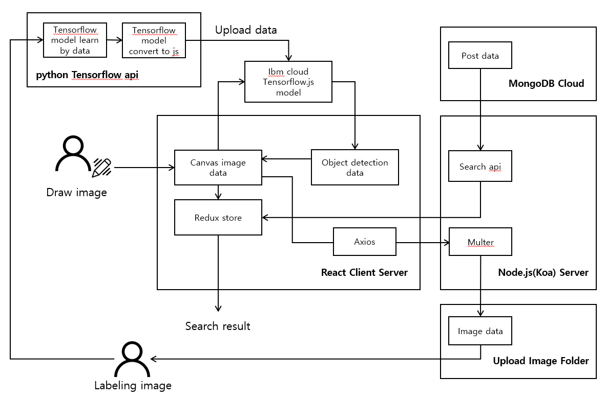
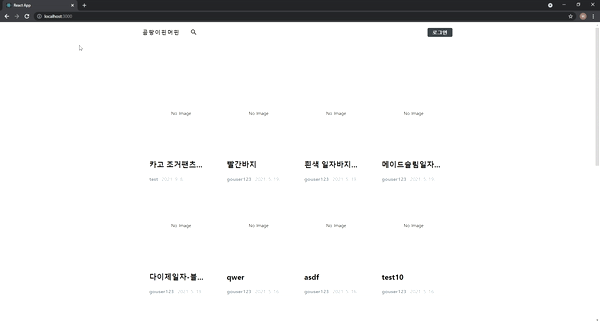
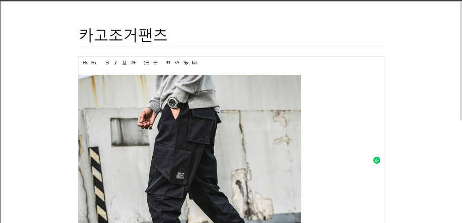
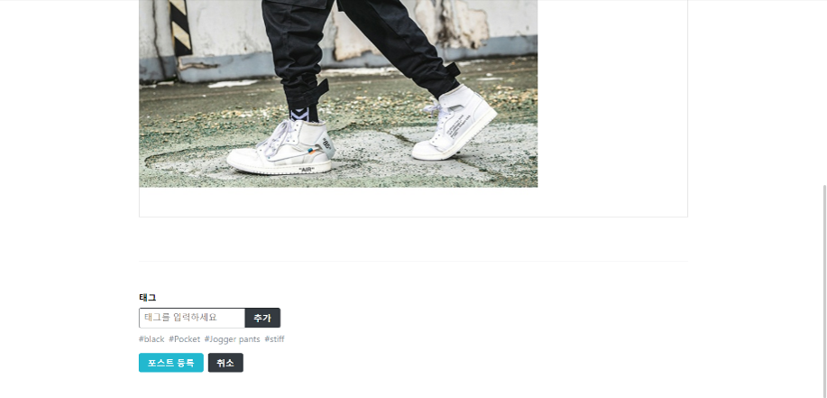
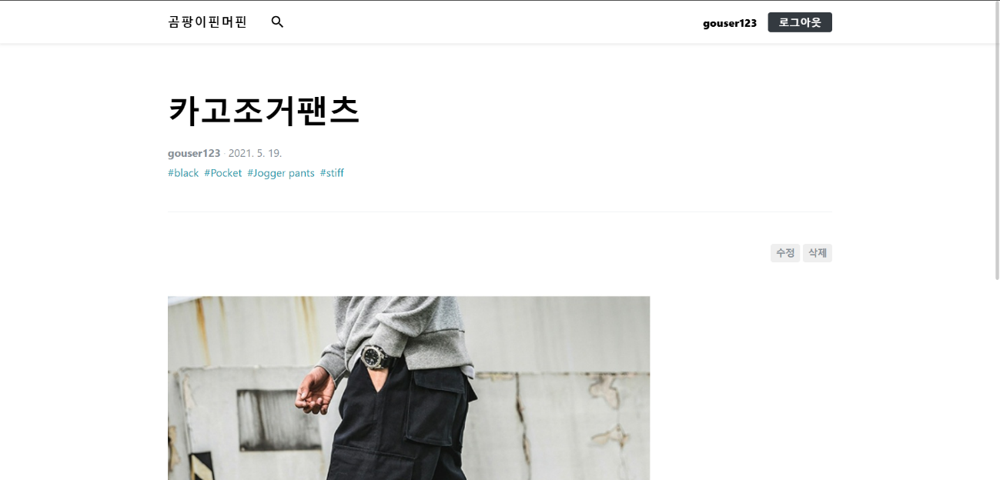
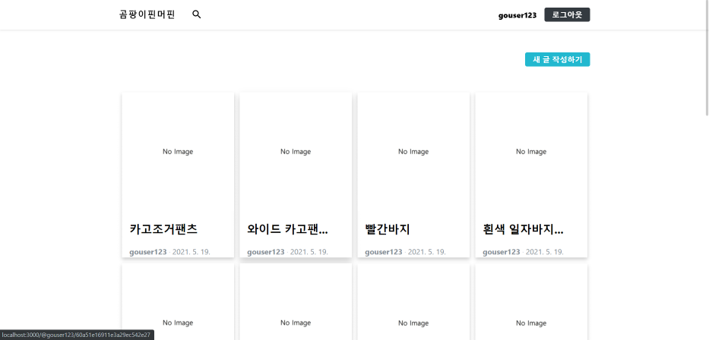
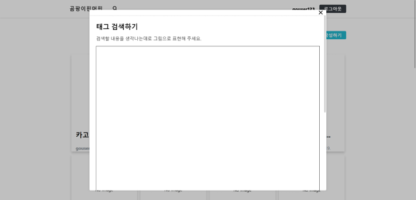
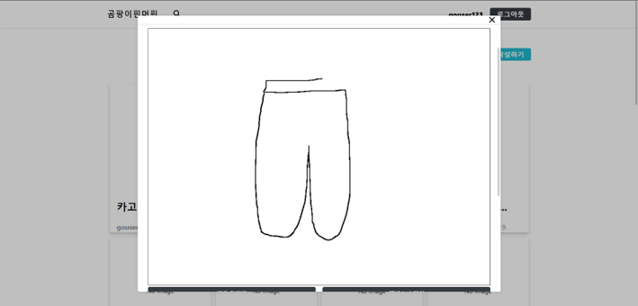
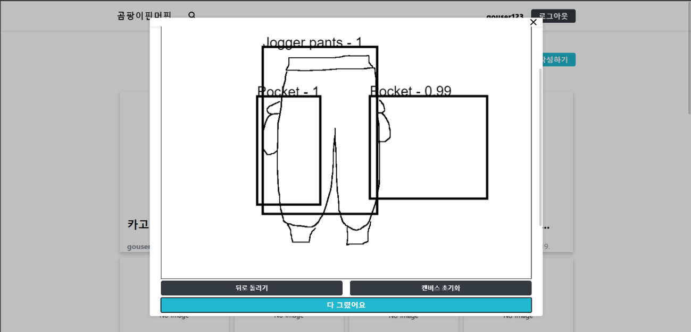
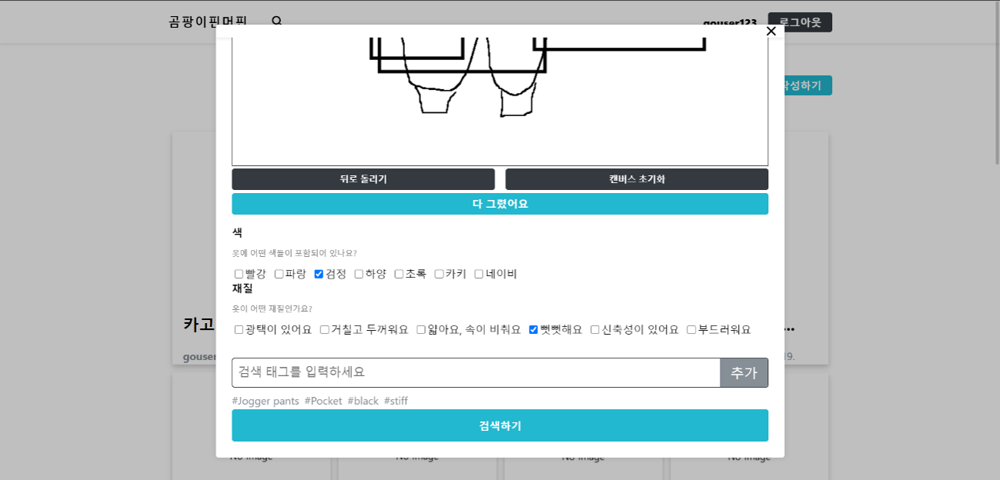

# 졸업작품용 리액트 프로젝트 입니다.

## 구성도

  

## 동작 화면

| | |
| :-------------------------: | :-------------------------: |
|  |  |
|  |  |
|  |  |
|  |  |

자신이 원하는 상품을 그림으로 그려 검색할 수 있는 시스템 입니다.
 
**작업시간** : 약 2달  
**링크** : -
 

## 개요

- 서비스 : tansorflow를 이용한 검색 기능
- 개발 환경 : visual code
- 개발 언어 : javascript
- 기타 환경 : Git
- 외부 지원 : react.js, tansorflow, object detection

 

## 내용

- tansorflow를 이용하여 object detection 모델 구현
- react를 이용한 frontend 구현
- node.js koa를 이용한 backend 구현
- mongo DB 이용
- redux와 saga를 이용한 상태관리, axios를 이용한 통신 구현
- jwt 방식으로 로그인 구현
